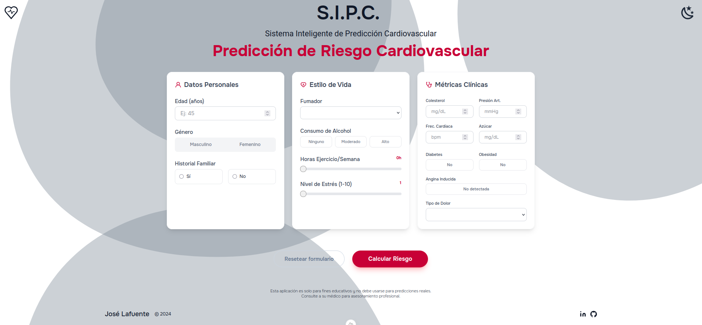
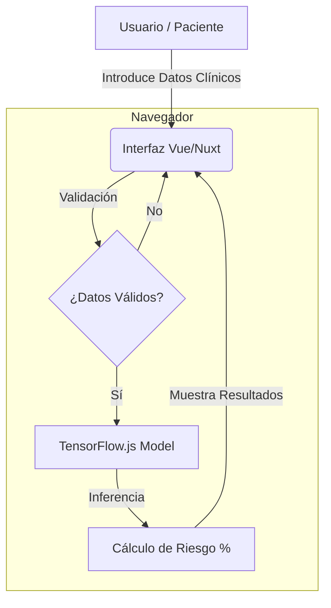
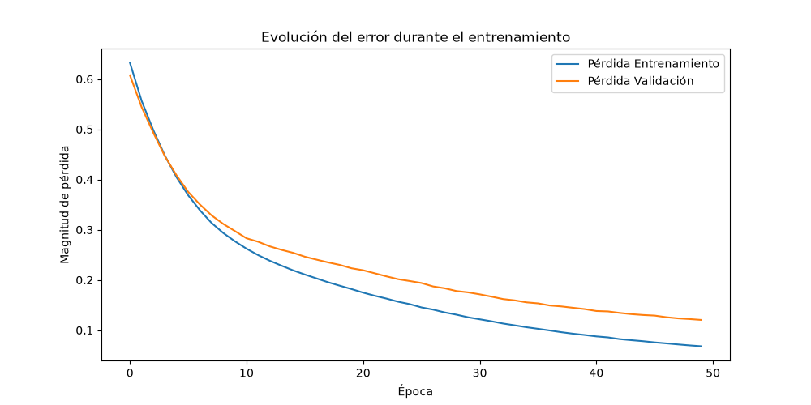

# Sistema Inteligente de Predicción Cardiovascular (SIPC)

<div align="center">
  
</div>

## Descripción
El Sistema Inteligente de Predicción Cardiovascular (SIPC) es una herramienta diseñada para predecir el riesgo de enfermedades cardiovasculares en pacientes utilizando algoritmos de aprendizaje automático. Este sistema utiliza datos clínicos del paciente para evaluar el riesgo y proporcionar recomendaciones preventivas.

## Características
- **Predicción Basada en Datos Clínicos**: Utiliza información clínica del paciente como niveles de azúcar en sangre, tipo de dolor en el pecho, entre otros, para realizar predicciones.
- **Interfaz Moderna y Responsive**: Rediseñada con secciones claras, controles interactivos (sliders, toggles) y visualización de datos mejorada.
- **Modo Oscuro**: Soporte nativo para tema claro y oscuro, con detección automática de preferencia del sistema y persistencia.
- **Resultados Inmediatos**: Proporciona predicciones en tiempo real con una representación porcentual del riesgo cardiovascular.

## Tecnologías Utilizadas
- [Nuxt 4](https://nuxt.com/ "Title"): Para la interfaz de usuario y la interactividad del frontend, utilizando la última arquitectura de Nuxt.


- [Tensorflow.js](https://www.tensorflow.org/js?hl=es): Para ejecutar modelos de aprendizaje automático directamente en el navegador.


- [Tailwind CSS v4](https://tailwindcss.com/): Para estilizar la aplicación con el nuevo motor de estilos y theming manual mediante variables CSS.


- [Heart Disease prediction](https://www.kaggle.com/datasets/rashadrmammadov/heart-disease-prediction?resource=download)

- **Vitest & Vue Test Utils**: Para la ejecución de pruebas unitarias y cobertura de código (*coverage*).


## Arquitectura del Sistema



## Rendimiento del Modelo de IA
Durante el entrenamiento del modelo neuronal, se analizó la convergencia de la función de pérdida (Loss), demostrando un aprendizaje estable:

<div align="center">
  
</div>

## Instalación
Para instalar y ejecutar el SIPC en tu entorno local, sigue estos pasos:

1. Clona el repositorio:
```bash
git clone https://github.com/LafuenteColoradoJose/sipc.git
```
2. Navega al directorio del proyecto:
```bash
cd sipc
```
3. Instala las dependencias:
```bash
npm install
```
4. Inicia la aplicación en modo desarrollo:
```bash
npm run dev
```
5. Abre tu navegador y navega a la siguiente dirección:
```
http://localhost:3000/
```

## Pruebas (Testing) y Cobertura (Coverage)
El proyecto cuenta con pruebas unitarias implementadas con **Vitest**. Para ejecutar la batería de pruebas y comprobar que todos los componentes se renderizan e interactúan correctamente:

```bash
npm run test
```

Para generar un reporte de cobertura de código (Code Coverage) utilizando el motor `v8`:

```bash
npm run coverage
```
## Uso
Para utilizar el SIPC, sigue estos pasos:
1. Ingresa los datos clínicos del paciente utilizando los formularios interactivos.
2. Haz clic en el botón "Calcular Riesgo" para procesar los datos con el modelo de IA.
3. Revisa la predicción visual y las métricas proporcionadas por el sistema.

## Para probarlo en línea
Desplegado en Vercel: [SIPC](https://sipc.vercel.app/)